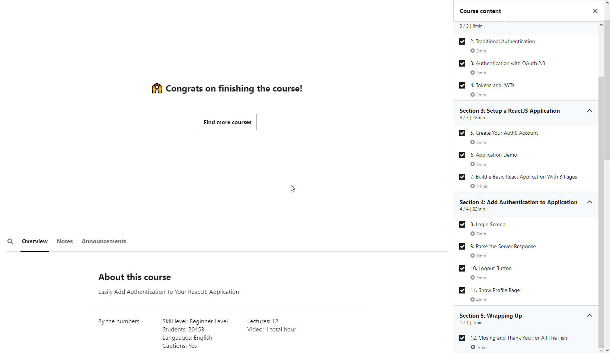

# First commit
Learned from Udemy.

This was a good 1 hour lesson on authentication and Google profile retrieval with JSON. 
I do need to learn more on how to authenticate with self-made database and how to retrieve info from there.

